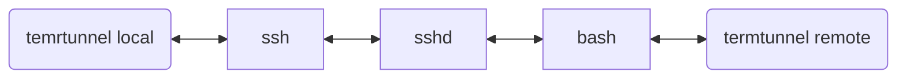

# Termtunnel [](https://github.com/beordle/termtunnel/actions/workflows/build.yml)
Termtunnel is a tool that allows you to create a tunnel via multiple hops or fight against intranet isolation in a very simple way. As lrzsz can, termtunnel supports not only file transfer but also network proxy.

## Quickstart

**You must ensure that the termtunnel binary exists on both the local and remote first.**

Please use termtunnel to open any locally terminal application such as ssh, bash, etc.

```bash
sh-3.2$ >> termtunnel ssh root@19.95.02.23
```

After running, the terminal output is the same as without the `termtunnel` prefix, and you can keep your normal usage habits.
```bash
sh-3.2$ >> termtunnel ssh root@19.95.02.23
root@host:~# echo loulou
loulou
root@host:~# uname -a
Linux 5.10.0-11-amd64 #1 SMP Debian 5.10.92-2 (2022-02-28) x86_64 GNU/Linux
```

When a tunnel needs to be established, just run command `termtunnel -a` on that remote host.

For example, you can execute `termtunnel ssh root@19.95.02.23` locally, then start `/tmp/termtunnel -a` on the ssh host to enter the termtunnel shell

In the termtunnel shell, you are allowed to download and upload files or create socks5 proxy.

**So how to use the console?**  *See [Use case](#use-case) please.*

```bash
sh-3.2$ >> termtunnel ssh root@19.95.02.23
root@host:~# /tmp/termsocks -a
termtunnel>> help
```
[Use case](#use-case) 
## Install
* Linux
   * Provide prebuilt static binaries to run. See [lastest releases](https://github.com/beordle/termtunnel/releases/latest)

* MacOS
   * `brew install beordle/tap/termtunnel`

## Working principle

As you can imagine, we use the method of tapping the string to upload a message to the remote in terminal, and then get a message back from the remote, and in this way, we get a point-to-point transmission channel.



Termtunnel use pty to control local application, write data to its stdin, and read data from its stdout. and then the local application stdin and stdout be linked with remote termtunnel.


## Use case

> This documentation may be out of date, please refer to the output of the **help** command  if necessary.
#### Download a file to local
* type **download** and Enter
   * download a file
#### Upload a file to remote
* type **upload** and Enter
   * upload a file

#### Share local internet with remote

* type **local_listen**
#### Share local internet yum mirror with remote

* type **local_listen**

#### Share Intranet host 123.123.123.123's VNC port 5100 with local
* type **local_listen 127.0.0.1 3333 123.123.123.123 5100** and enter


## Build from Source
```bash
cmake .
make
```

## FAQ

1. **Can I make the whole process unattended？** To reduce user intervention, you can try to use UNIX expect tool.
2. **How to use it with tmux？** Out of the box. Designed with tmux in mind. But because of the implementation of tmux, the speed is very limited. If you want to improve the speed, you need to modify the source code and recompile tmux
3. **My office network can't connect to apt, and yum, etc, can this program help me？** Yes, use `remote_listen`
## License
This application is free software; you can redistribute it and/or modify it under the terms of the MIT license. See LICENSE file for details.
