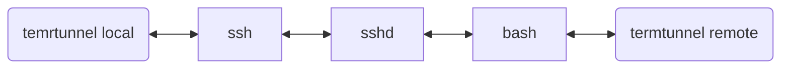

# Termtunnel [](https://github.com/beordle/termtunnel/actions/workflows/build.yml)
Termtunnel is a tool allow you create an tunnel via multiple hops or fight against intranet isolation in a very simple way. As lrzsz can, termtunnel supports not only file transter but also network proxy.

## Quick start

**You must ensure that the termtunnel binary exists on both the local and remote.**

Please use termtunnel to open any locally terminal application such as ssh, bash, etc.

```bash
sh-3.2$ >> termtunnel ssh root@19.95.02.23
```

After running, the terminal output is the same as without the `termtunnel` prefix, and you can keep your normal usage habits.
```bash
sh-3.2$ >> termtunnel ssh root@19.95.02.23
root@host:~# echo loulou
loulou
root@host:~# uname -a
Linux 5.10.0-11-amd64 #1 SMP Debian 5.10.92-2 (2022-02-28) x86_64 GNU/Linux
```

When a tunnel needs to be established, just run command `termtunnel -a` on that remote host.

In remote termtunnel console, you are allowed to download files up and down, or create socks5 proxy.

For example, you can execute `termtunnel ssh root@19.95.02.23` locally, then start `/tmp/termtunnel -a` on the ssh host to enter the interactive console, and then you can type `upload` to upload local file to remote or create a port forward. supported commands are listed in the [REPL Command](#repl-command) section.
```bash
sh-3.2$ >> termtunnel ssh root@19.95.02.23
root@host:~# /tmp/termsocks -a
termtunnel>> help
```

## Install
* Linux 
   * Provide prebuilt static binaries to run. See [lastest releases](https://github.com/beordle/termtunnel/releases/latest)

* MacOS
   * `brew install beordle/tap/termtunnel`

## Working principle

As you can imagine, we use the method of tapping the string to upload a message to remote in Terminal, and then get a message back from remote in the Terminal, and in this way, we get a point-to-point transmission channel.



Simply put, Termtunnel use pty to control local application, write data to its stdin, read data from its stdout. and then the local appliction stdin and stdout be link with remote termtunnel.


## REPL Command

> This documentation may be out of date, please refer to the output of the **help** command.
> 
* **help**:
   * view command help
      
* **local_listen**
   * local_listen [local_host] [local_port] [remote_host] [remote_port]
   * when remote_port==0, the service listen on remote_port will be a socks5.

* **remote_listen**
   * remote_listen [remote_host] [remote_port] [local_host] [local_port]
   * when remote_port==0, the service listen on remote_port will be a socks5.

* **download**
   * download a file 
* **upload**
   * upload a file

   
## Build from Source
```bash
cmake .
make
```

## FAQ

1. **Can I make the whole process unattended？** To reduce user intervention, you can try to use UNIX expect tool.
2. **How to use it with tmux？** Out of the box. Designed with tmux in mind. But because of the implementation of tmux, the speed is very limited. If you want to improve the speed, you need to modify the source code and recompile tmux
3. **My office network can't connect to apt, and yum etc, can this program help me？** Yes, use `remote_listen`
## License
This application is free software; you can redistribute it and/or modify it under the terms of the MIT license. See LICENSE file for details.
